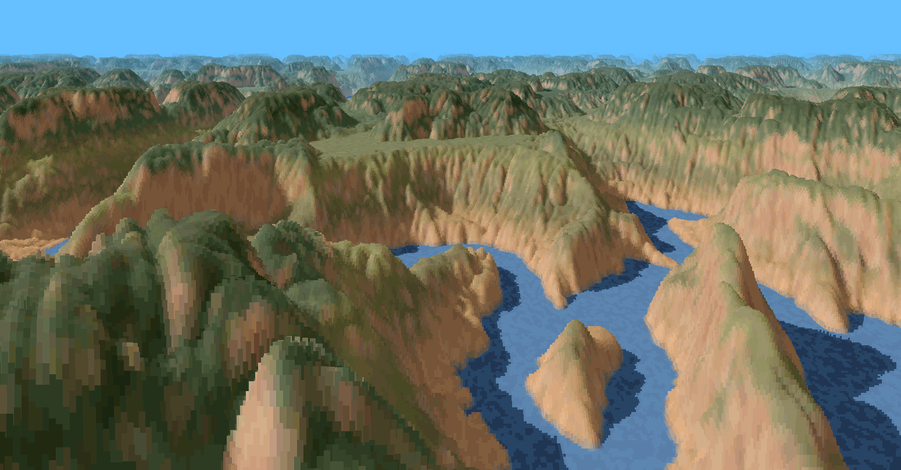
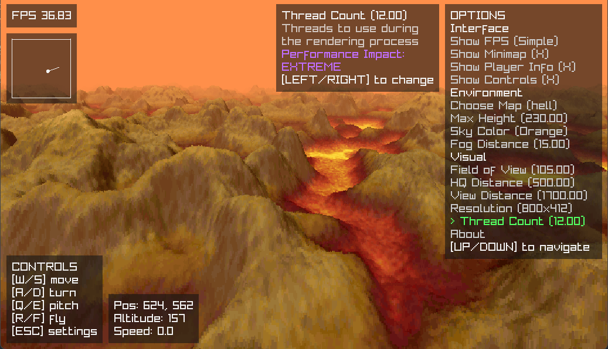

# Yükselti
Yükselti is an implementation of [Voxel Space](https://en.wikipedia.org/wiki/Voxel_Space) -a 2.5D software rendering technique that uses color and height maps to render pseudo-3D terrain- written in C using [Raylib](https://www.raylib.com/).

<p align="left">
  
  
  
</p>




## Acknowledgements
The idea and the provided map files are taken from [this](https://github.com/s-macke/VoxelSpace/) repo by s-macke.

## Building and Development

### Requirements
- CMake >= 3.24
- C compiler
- Raylib 5.5 (Automatically downloaded by CMake if not found)
- Raylib's [dependencies](https://github.com/raysan5/raylib/wiki/Working-on-GNU-Linux) (Linux Only)

### Build Instructions
1. Clone and enter the repo
```console
git clone https://github.com/reuzdev/yukselti
cd yukselti
```

2. Create and enter a build directory
```console
mkdir build
cd build
```

3. Generate build files by following the instructions for your platform below. If you don't want to build in Release configuration omit the related flags.

##### Windows (MSVC)
> Replace "17 2022" with your version of Visual Studio
> ```console
> cmake -G "Visual Studio 17 2022" ..
> cmake --build . --config Release
> ```
> The executable will be at `./Release/yukselti.exe` or `./Debug/yukselti.exe` depending on the configuration.

##### Windows (MinGW)
> ```console
> cmake -G "MinGW Makefiles" -DCMAKE_BUILD_TYPE=Release ..
> cmake --build .
> ```

##### Linux
> ```console
> cmake -G "Unix Makefiles" -DCMAKE_BUILD_TYPE=Release ..
> cmake --build .
> ```

## License
[MIT](https://choosealicense.com/licenses/mit/)
